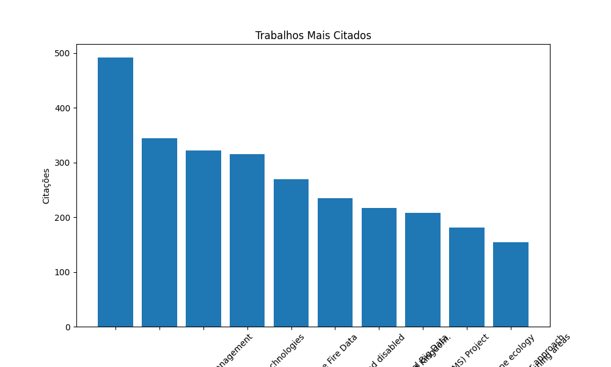

# UrbanLitTracker - Coleta e Análise de Literatura Urbana

O UrbanLitTracker é uma ferramenta projetada para coletar, processar e armazenar artigos acadêmicos relevantes para o estudo de mudanças urbanas e expansão urbana. Utilizando a API do OpenAlex, ele extrai dados de publicações científicas, aplica filtros por idioma e período, e armazena os resultados em um banco de dados MongoDB para análise posterior.

## Funcionalidades Principais

* **Extração de Dados:** Coleta artigos acadêmicos através de consultas personalizadas à API do OpenAlex (por exemplo, "urban change detection" OR "Urban Sprawl").
* **Transformação e Limpeza:** Processa os dados para compatibilidade com o MongoDB, incluindo a renomeação do campo `id` para `_id`.
* **Armazenamento em Banco de Dados:** Salva os documentos processados em um banco de dados MongoDB, facilitando consultas e análises.
* **Navegação e Resiliência:** Implementa paginação para grandes volumes de dados e mecanismos para lidar com erros de rede, como reconexão em caso de erro 403.
* **Monitoramento de Progresso:** Exibe uma barra de progresso durante a execução usando a biblioteca `tqdm`.
* **Análise de Dados e Visualização:**
    * Cria tabelas e gráficos interativos para visualizar os dados coletados.
    * Identifica os trabalhos mais relevantes e citados.
    * Analisa a distribuição das publicações ao longo dos anos.
    * Lista os autores e instituições mais frequentes.
    * Extrai e analisa as palavras-chave mais comuns.
    * **Exportação de Dados:** Os dados analisados podem ser exportados para arquivos CSV, facilitando o uso em outras ferramentas.
    * **Interface Interativa:** O Dashboard criado com Dash e Dash Mantine Components oferece uma interface interativa para explorar os dados.

## Tecnologias Utilizadas

* **Python:** Linguagem de programação principal.
* **OpenAlex API:** Fonte de dados para artigos acadêmicos.
* **MongoDB:** Banco de dados NoSQL para armazenamento de documentos.
* **Dash e Dash Mantine Components:** Criação de dashboard interativo
* **Bibliotecas Python:**
    * `pymongo`: Interação com o MongoDB.
    * `pyalex`: Consultas à API do OpenAlex.
    * `tqdm`: Exibição de barra de progresso.
    * `logging`: Registro de logs e depuração.
    * `pandas`: manipulação e análise de dados.
    * `plotly`: Criação de gráficos interativos.

## Como Utilizar

### Configuração

1.  Instale as dependências: `pip install pymongo pyalex tqdm dash dash-mantine-components pandas plotly`
2.  Configure a URI do MongoDB no script (`MONGO_URI`).
3.  Defina a consulta desejada (`QUERY`) e o intervalo de datas (`from_publication_date` e `to_publication_date`).

### Execução

1.  Execute o script: `python app.py`.
2.  O progresso da coleta e processamento será exibido na barra de progresso.
3. Execute o script do Dashboard: python app.py
4. Acesse o dashboard no seu navegador.

### Resultados

* Os documentos coletados serão armazenados na coleção `bibliometria` do banco de dados `gyn-sefin`.
* O Dashboard irá disponibilizar diversas tabelas e gráficos para a visualização dos dados, e também irá disponibilizar a opção de exportar os dados para csv.